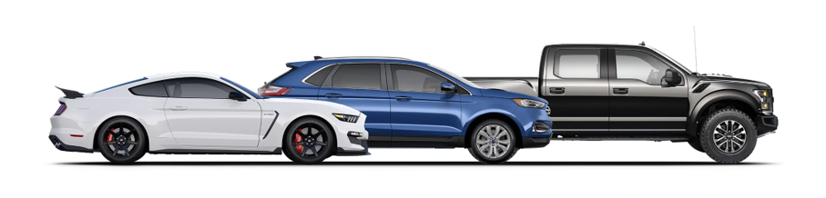
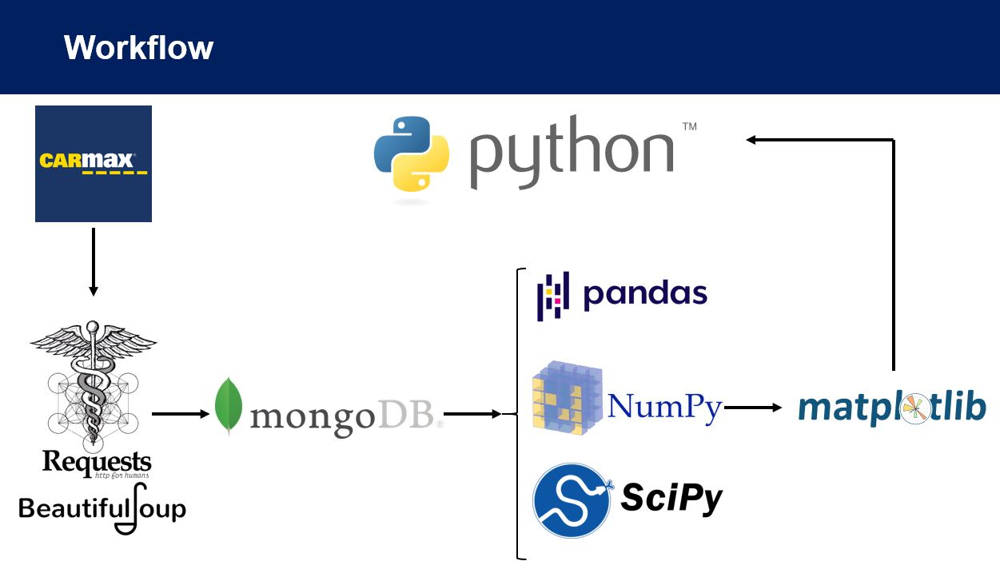
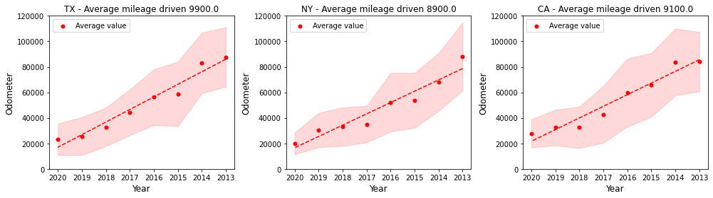
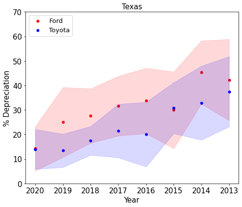
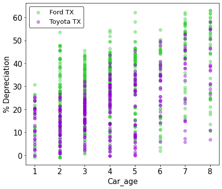
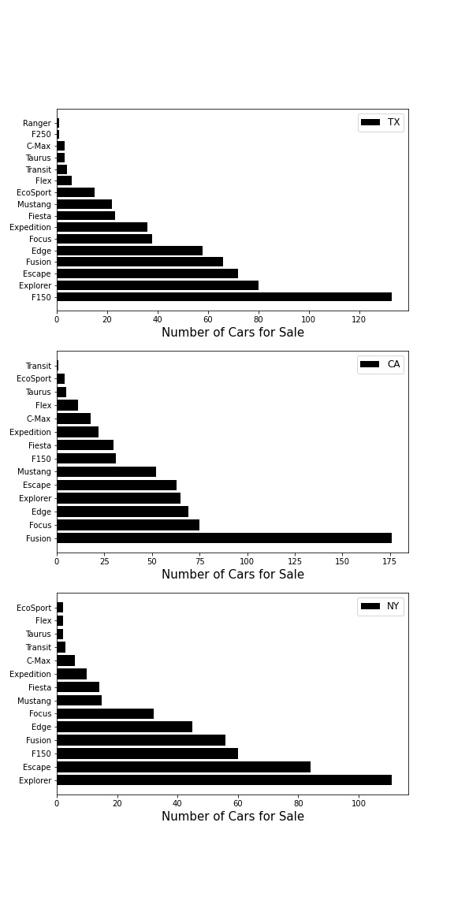

# Capstone Project 1: Car Price Analysis

In this work, we looked at the price of different cars across several states (i.e., Texas, California, and New York State).
* fsd

## Web Scraping
In this project, we started to web scrape the CARMAX website. The file that used to scrape the website is called "Test_scraping.ipynb". It is worth mentioning that two popular car brands (Ford and Toyota) currently availble for sale on CARmax in Texas, California, and New York state between the years of 2012-2020 were the filtering criteria for data extraction.

The follwoing figure shows the summary of the workflow:

As can be seen, BeautifulSoup is used to scrape the data from CARmax website. Then, the scraped data is stored in Mongo database. Afterwards, python libraries were used for data cleaning, analysis, and visualization. 

## EDA Analysis

Features that were extracted and used in this study include:
* Car mileage
* Car price
* Car mpg
* Car model
* Car model year
* Car make
* Car color
* Car transmission type
* Car engine size
* Car horse power
* Car engine cylinder
* Car msrp price
* State

## Data Insights

## Statistical Analysis
###  

The analysis would help in evaluating/comparing the impact of car features on car price. 

    

## Future Work
* Include more car data from CARmax into the database
* Include data from other used car retailers
* Web scraping the CARFAX dataset to include the # of accidents and services for each car
* Apply machine learning algorithms to predict the price of cars on CARMAX
