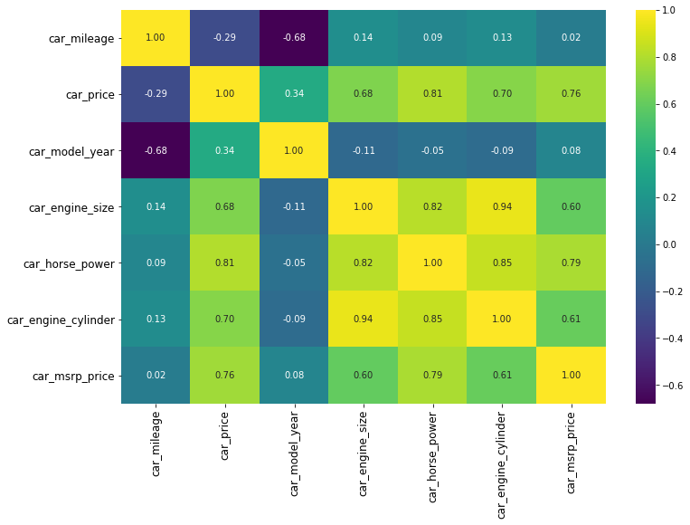
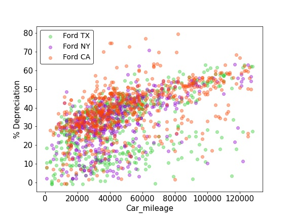
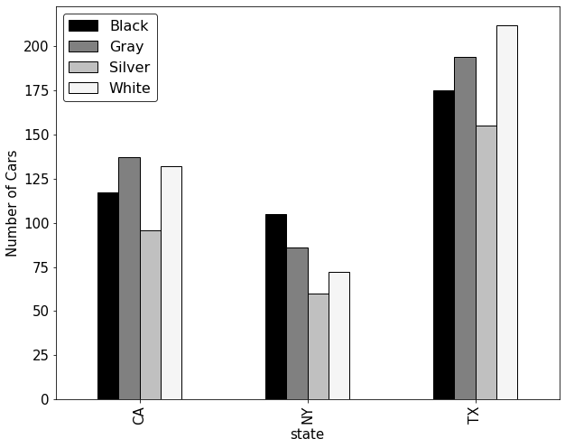
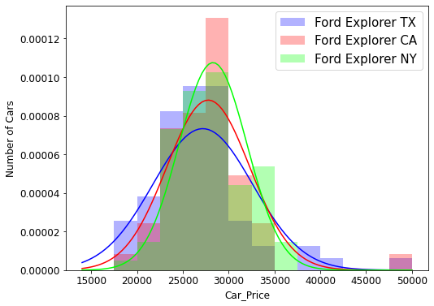
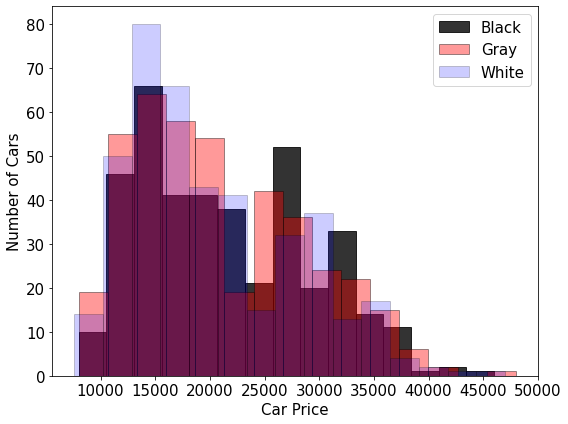
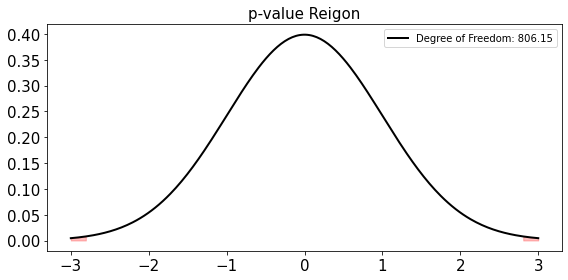

# Capstone Project 1: Car Price Analysis
*Does the cars from different states listed on CARmax have the same MSRP price on CARmax website?*

*Does the cars with different colors listed on CARmax have the same MSRP price on CARmax wbsite?*

In this work, we looked at the price of different cars across several states (i.e., Texas, California, and New York State) to answer the above statistical questions.

## Web Scraping
In this project, we scraped the CARMAX website. The file that used to scrape the website is called "Test_scraping.ipynb". It is worth mentioning that two popular car brands (Ford and Toyota) currently availble for sale on CARmax in Texas, California, and New York state between the years of 2012-2020 were the filtering criteria for data extraction.

The follwoing figure shows the summary of the workflow:

As can be seen, BeautifulSoup is used to scrape the required data from CARmax website. Then, the scraped data is stored in Mongo database. Afterwards, python libraries were used for data cleaning, analysis, and visualization. 

## EDA Analysis
After loading the data into pandas dataframe format, we performed data-preprocessing on the data and made sure that the formatting and values are reasonable. The following tasks are examples of data preprocessing job that has been done:
* **Remove Outliers**: Price, Model, Depreciation value
* **Handle Null Values**: Remove/replace values based on the feature importance
* **Handle columns data type**
* **Grouping**: Grouping columns based on car make, model, and year

Features that were extracted and used in this study include:
* Car mileage
* Car price
* Car mpg
* Car model
* Car model year
* Car make
* Car color
* Car transmission type
* Car engine size
* Car horse power
* Car engine cylinder
* Car msrp price
* State

After cleaning, removing, and merging the data, there were about 2400 cars with 13 features were used for further analysis.

## Data Insights
The following figure shows the correlation heap map for some of the important features of the dataset. As can be seen, car mileage has negative impact on car price.

We also looked into the car mileage across these three different states as shown below. The dots show the mean mileage value for each year and colored area is related to the price with one standatd deviation from the mean value.

* Average miles driven per year for each state:
    * TX: 9,900 miles
    * CA: 9,200 miles
    * NY: 8,900 miles
    * US Department of Transportation: 13,500 miles

As can be seen, the cars for sale on CARMAX have lower mileage compared to the reported mileage by US Department of Transportation. In addition, the cars in TX have higher mileage than California and New York state. This observation can be related to the size of each state and public transportation.

We also looked at depreciation of Ford cars in these three states as shown below. In general, we did not observe significant difference in depreciation among the three States.

Then, we compared the depreciation of Ford and Toyota cars in Texas as shown below:

As can be seen, Toyota cars in general has lower depreciation rate compared to Ford cars. 

* Average car value depreciation:
    * CARmax assumes 15% depreciation annualy
    * CARFAX reports 20% average depreciation annualy in United States

The following figure also shows the top 4 popular colors in each state. For instance, white color is more popular than black cars in Texas. 

Finally, we summarized the popularity of car models in each state. As can be seen, F150, Fusion, and Explorer are the most popular cars in Texas, California, and New York, respectively.

## Statistical Analysis
###  

In this part, we investigated the impact of location and color on car price using hypothesis testing and determining the p-value.  

### Statistical Analysis-Q1
**Is the average listing price of Ford Explorer in TX, CA, and NY similar**

The null hypothesis for this test states that the average Ford Explorer price in Texas are equally likely to be higher than the NY (or CA) Ford Explorer price and the other way around. In other words,

*P(Average car price in TX < Average car price in CA/NY)=0.5*

The following figure illustrates the histogram of the Ford Explorer car price.

Accounting for the Bonferroni correction, the significance level is set to (0.05/3 = 0.017).
Since we did not make any distribution assumption for the car price and the number of each category was less than 50, We decided to use Mannwhitney U-test to determine the P-value for each scenario. The following tables shows the results of p-value calcualtion:

    * TX-CA: P-value = 0.47  --> Failed to reject null hypothesis
    * TX-NY: P-value = 0.015 --> Reject the null hypothesis
    * CA-NY: P-value = 0.49  --> Failed to reject the null hypothesis

Hence, we failed to reject null hypothesis for TX-CA and CA-NY tests. However, we rejected the null hypothesis for TX-NY case. Therefore, the probability that the mean price of Ford Explorer in TX is lower than the mean price of Ford Explorer is not equal to 0.5.

### Statistical Analysis-Q2
**Is the average listing price the same for different colors? (Black/Gray/White)**

The following figure shows the histogram of listing price for Black, Gray, and White cars. Based on the data, the mean price of black, gray, and white cars are $21,550, $20,800, and $20,000, respectively.

Ho: the average listing price is the same for different car colors.

Ha: the average listing price is not the same for different car colors.

Significance level: 0.05/3 = 0.0167 (with a Bonferroni correction for three test)

A Welch's t-test was chosen for the analysis due to the large size of the population.

    * Black-Gray: P-value = 0.14  --> Failed to reject null hypothesis
    
    * Gray-White: P-value = 0.19  --> Failed to reject the null hypothesis

    * Black-White: P-value = 0.19 --> Reject the null hypothesis

Hence, it can be concluded that the mean price of black cars are not the same as the white cars

## Future Work
* Include more car data from CARmax into the database
* Include data from other used car retailers
* Web scraping the CARFAX dataset to include the number of accidents and services for each car
* Apply machine learning algorithms to predict the price of cars on CARMAX
